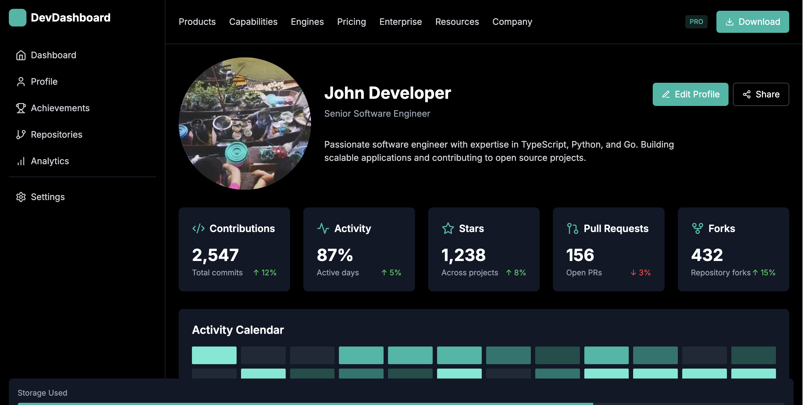

# Hacker Dashboard

[English](#english) | [中文](#简体中文) | [日本語](#日本語)



---

<a id="english"></a>
## English

A modern, responsive dashboard for developers to showcase their coding activities, skills, and achievements. Built with Next.js, TypeScript, and Tailwind CSS.

### Features

- 📊 Interactive Activity Tracking
- 🎯 Language Distribution Visualization
- 📈 Contribution Statistics
- 🏆 Achievement System
- 📱 Fully Responsive Design
- 🎨 Modern UI with Tailwind CSS
- ⚡ Real-time Updates
- 🔒 Type-safe Implementation

### Quick Start

```bash
# Install dependencies
npm install

# Run development server
npm run dev
```

Visit [http://localhost:3000](http://localhost:3000)

---

<a id="简体中文"></a>
## 简体中文

为开发者打造的现代化响应式仪表板，用于展示编码活动、技能和成就。使用 Next.js、TypeScript 和 Tailwind CSS 构建。

### 特性

- 📊 互动式活动追踪
- 🎯 编程语言分布可视化
- 📈 贡献统计
- 🏆 成就系统
- 📱 完全响应式设计
- 🎨 现代化 UI 界面
- ⚡ 实时更新
- 🔒 类型安全实现

### 快速开始

```bash
# 安装依赖
npm install

# 运行开发服务器
npm run dev
```

访问 [http://localhost:3000](http://localhost:3000)

---

<a id="日本語"></a>
## 日本語

開発者向けのモダンでレスポンシブなダッシュボード。コーディング活動、スキル、実績を表示します。Next.js、TypeScript、Tailwind CSSで構築。

### 機能

- 📊 インタラクティブな活動追跡
- 🎯 プログラミング言語の分布可視化
- 📈 コントリビューション統計
- 🏆 実績システム
- 📱 完全レスポンシブデザイン
- 🎨 モダンなUI
- ⚡ リアルタイム更新
- 🔒 型安全な実装

### クイックスタート

```bash
# 依存関係のインストール
npm install

# 開発サーバーの起動
npm run dev
```

[http://localhost:3000](http://localhost:3000) にアクセス

---

## Tech Stack

- **Framework:** Next.js 14
- **Language:** TypeScript
- **Styling:** Tailwind CSS
- **Icons:** Lucide React
- **Development:** ESLint, Prettier

## Project Structure

```
src/
├── app/
│   ├── layout.tsx       # Root layout component
│   └── page.tsx         # Home page component
├── components/
│   ├── layout/
│   │   ├── Header.tsx   # Top navigation
│   │   └── Sidebar.tsx  # Left sidebar navigation
│   └── features/
│       ├── ActivityCalendar.tsx
│       ├── LanguageChart.tsx
│       └── StatsCards.tsx
├── styles/
│   └── globals.css      # Global styles and Tailwind directives
└── types/               # TypeScript type definitions
```

## Contributing

1. Fork the repository
2. Create your feature branch (`git checkout -b feature/AmazingFeature`)
3. Commit your changes (`git commit -m 'Add some AmazingFeature'`)
4. Push to the branch (`git push origin feature/AmazingFeature`)
5. Open a Pull Request


---

Made with ❤️ by [JohnCachy](https://github.com/chinshunyu)
